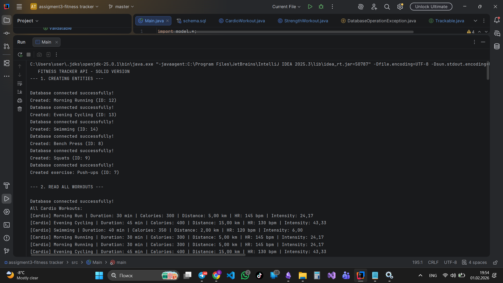
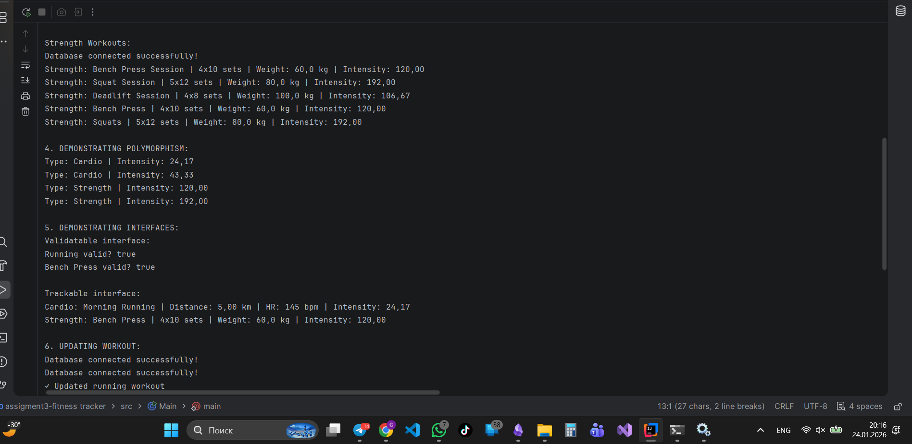
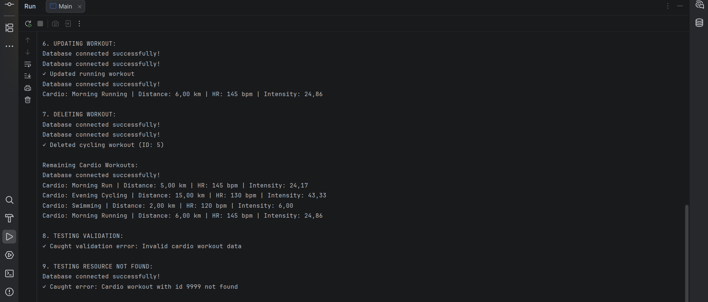

# Fitness Tracker API

## A. Project Overview

### Purpose
This Fitness Tracker API is a Java-based application that manages workout data using PostgreSQL database. It demonstrates advanced OOP principles, JDBC operations, and multi-layer architecture.

### Entities and Relationships
- **Workout** (Abstract Base Class) - Base entity for all workout types
- **CardioWorkout** - Extends Workout for cardio activities (running, cycling, swimming)
- **StrengthWorkout** - Extends Workout for strength training (weightlifting, bodyweight exercises)
- **Exercise** - Represents individual exercises with composition relationship

### OOP Design Overview
The project implements:
- **Inheritance**: CardioWorkout and StrengthWorkout extend abstract Workout class
- **Polymorphism**: Workouts can be handled through base class reference
- **Encapsulation**: Private fields with getters/setters
- **Abstraction**: Abstract methods for workout type and intensity calculation
- **Composition**: Exercise entities can be part of workouts
- **Interfaces**: Validatable and Trackable for common behaviors

---

## B. OOP Design Documentation

### Abstract Class: Workout
**Fields:**
- `id` (int) - Unique identifier
- `name` (String) - Workout name
- `durationMinutes` (int) - Duration in minutes
- `caloriesBurned` (int) - Calories burned

**Abstract Methods:**
- `String getWorkoutType()` - Returns type of workout
- `double calculateIntensity()` - Calculates workout intensity

**Concrete Methods:**
- `boolean isValid()` - Validates workout data
- `void displayInfo()` - Displays workout information

### Subclasses

#### 1. CardioWorkout
**Additional Fields:**
- `distanceKm` (double) - Distance covered
- `averageHeartRate` (int) - Average heart rate

**Implemented Methods:**
- `getWorkoutType()` - Returns "Cardio"
- `calculateIntensity()` - (HR / duration) * distance

#### 2. StrengthWorkout
**Additional Fields:**
- `sets` (int) - Number of sets
- `reps` (int) - Repetitions per set
- `weightKg` (double) - Weight used

**Implemented Methods:**
- `getWorkoutType()` - Returns "Strength"
- `calculateIntensity()` - (sets * reps * weight) / duration

### Interfaces

#### Validatable
```java
boolean validate();
```
Ensures data integrity before database operations.

#### Trackable
```java
String getTrackingInfo();
```
Provides formatted tracking information for display.

### Composition/Aggregation
**Exercise** class is used as a standalone entity that can be associated with workouts, demonstrating composition pattern.

### Polymorphism Example
```java
Workout[] workouts = {cardioWorkout, strengthWorkout};
for (Workout w : workouts) {
    w.displayInfo();  // Polymorphic call
    w.calculateIntensity();  // Different implementation for each type
}
```

---

## C. Database Description

### Schema
```sql
-- Cardio Workouts Table
CREATE TABLE cardio_workouts (
    id SERIAL PRIMARY KEY,
    name VARCHAR(100) NOT NULL,
    duration_minutes INT NOT NULL CHECK (duration_minutes > 0),
    calories_burned INT NOT NULL CHECK (calories_burned > 0),
    distance_km DECIMAL(10, 2) NOT NULL CHECK (distance_km > 0),
    average_heart_rate INT NOT NULL CHECK (average_heart_rate > 0),
    created_at TIMESTAMP DEFAULT CURRENT_TIMESTAMP
);

-- Strength Workouts Table
CREATE TABLE strength_workouts (
    id SERIAL PRIMARY KEY,
    name VARCHAR(100) NOT NULL,
    duration_minutes INT NOT NULL CHECK (duration_minutes > 0),
    calories_burned INT NOT NULL CHECK (calories_burned > 0),
    sets INT NOT NULL CHECK (sets > 0),
    reps INT NOT NULL CHECK (reps > 0),
    weight_kg DECIMAL(10, 2) NOT NULL CHECK (weight_kg > 0),
    created_at TIMESTAMP DEFAULT CURRENT_TIMESTAMP
);

-- Exercises Table
CREATE TABLE exercises (
    id SERIAL PRIMARY KEY,
    name VARCHAR(100) NOT NULL,
    muscle_group VARCHAR(50) NOT NULL,
    equipment_needed VARCHAR(100)
);
```

### Constraints
- **Primary Keys**: All tables have auto-incrementing SERIAL primary keys
- **Check Constraints**: Numeric fields must be greater than 0
- **NOT NULL**: Required fields cannot be null

### Sample Inserts
See `schema.sql` for complete insert statements.

---

## D. Controller Layer

### CRUD Operations

#### Create Workout
```java
CardioWorkout running = new CardioWorkout("Morning Run", 30, 300, 5.0, 145);
service.createCardioWorkout(running);
// Response: Workout created with generated ID
```

#### Read All Workouts
```java
List<CardioWorkout> workouts = service.getAllCardioWorkouts();
// Response: List of all cardio workouts
```

#### Read Workout by ID
```java
CardioWorkout workout = service.getCardioWorkoutById(1);
// Response: Workout object or ResourceNotFoundException
```

#### Update Workout
```java
workout.setDurationMinutes(35);
service.updateCardioWorkout(1, workout);
// Response: Workout updated successfully
```

#### Delete Workout
```java
service.deleteCardioWorkout(1);
// Response: Workout deleted or ResourceNotFoundException
```

---

## E. Instructions to Compile and Run

### Prerequisites
- Java JDK 8 or higher
- PostgreSQL 12 or higher
- PostgreSQL JDBC Driver

### Database Setup
```bash
# Create database
psql -U postgres
CREATE DATABASE fitness_tracker;

# Run schema
psql -U postgres -d fitness_tracker -f resources/schema.sql
```

### Update Database Credentials
Edit `utils/DatabaseConnection.java`:
```java
private static final String URL = "jdbc:postgresql://localhost:5432/fitness_tracker";
private static final String USER = "your_username";
private static final String PASSWORD = "your_password";
```

### Compile
```bash
javac -cp ".:postgresql-42.7.0.jar" -d bin src/**/*.java
```

### Run
```bash
java -cp "bin:postgresql-42.7.0.jar" Main
```

---

## F. Screenshots

### Successful CRUD Operations



1. Creating workouts
2. Reading all workouts
3. Updating workout
4. Deleting workout
5. Polymorphism demonstration
6. Interface usage

---

## G. Reflection

### What I Learned
- Implementing abstract classes and interfaces in real applications
- Using JDBC with PreparedStatements for secure database operations
- Designing multi-layer architecture (Controller → Service → Repository)
- Creating custom exception hierarchies for better error handling
- Applying OOP principles (inheritance, polymorphism, encapsulation)

### Challenges Faced
- Properly handling SQLException and creating meaningful custom exceptions
- Ensuring proper resource management with try-with-resources
- Designing a clean separation between service and repository layers
- Implementing validation at both setter and service levels

### Benefits of JDBC and Multi-Layer Design
- **JDBC**: Direct database control, better performance, portable across databases
- **Multi-Layer**: Clear separation of concerns, easier testing, maintainable code
- **PreparedStatements**: Protection against SQL injection, better performance with reuse
- **Service Layer**: Centralized business logic and validation
- **Repository Pattern**: Abstraction of data access, easier to swap implementations

---

## Project Structure
```
fitness-tracker-api/
├── src/
│   ├── model/
│   │   ├── Workout.java (Abstract)
│   │   ├── CardioWorkout.java
│   │   ├── StrengthWorkout.java
│   │   ├── Exercise.java
│   │   ├── Validatable.java (Interface)
│   │   └── Trackable.java (Interface)
│   ├── repository/
│   │   ├── CardioWorkoutRepository.java
│   │   ├── StrengthWorkoutRepository.java
│   │   └── ExerciseRepository.java
│   ├── service/
│   │   └── WorkoutService.java
│   ├── exception/
│   │   ├── InvalidInputException.java
│   │   ├── DuplicateResourceException.java
│   │   ├── ResourceNotFoundException.java
│   │   └── DatabaseOperationException.java
│   ├── utils/
│   │   └── DatabaseConnection.java
│   └── Main.java
├── resources/
│   └── schema.sql
└── README.md
```

---

## License
This project is for educational purposes.